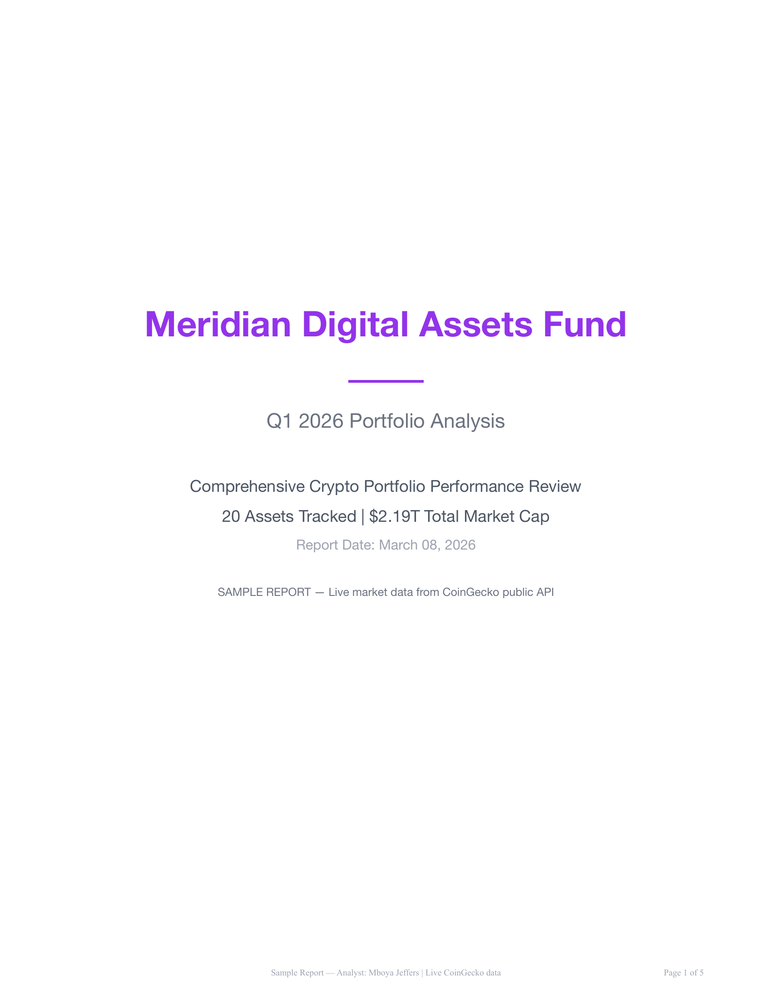
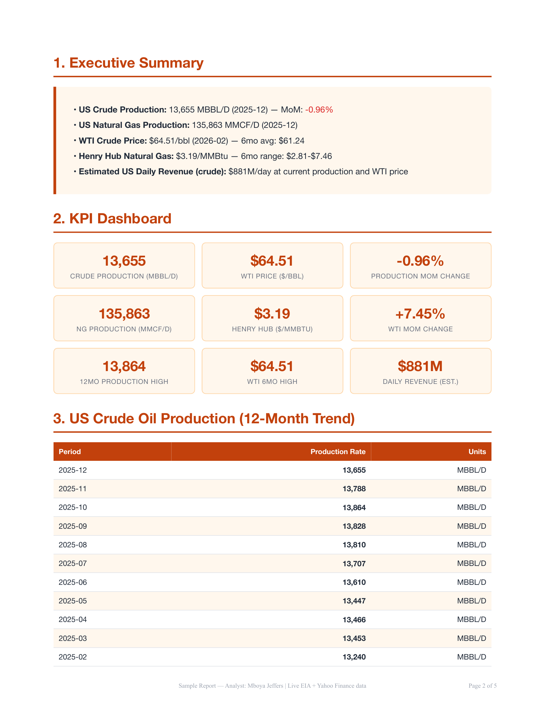
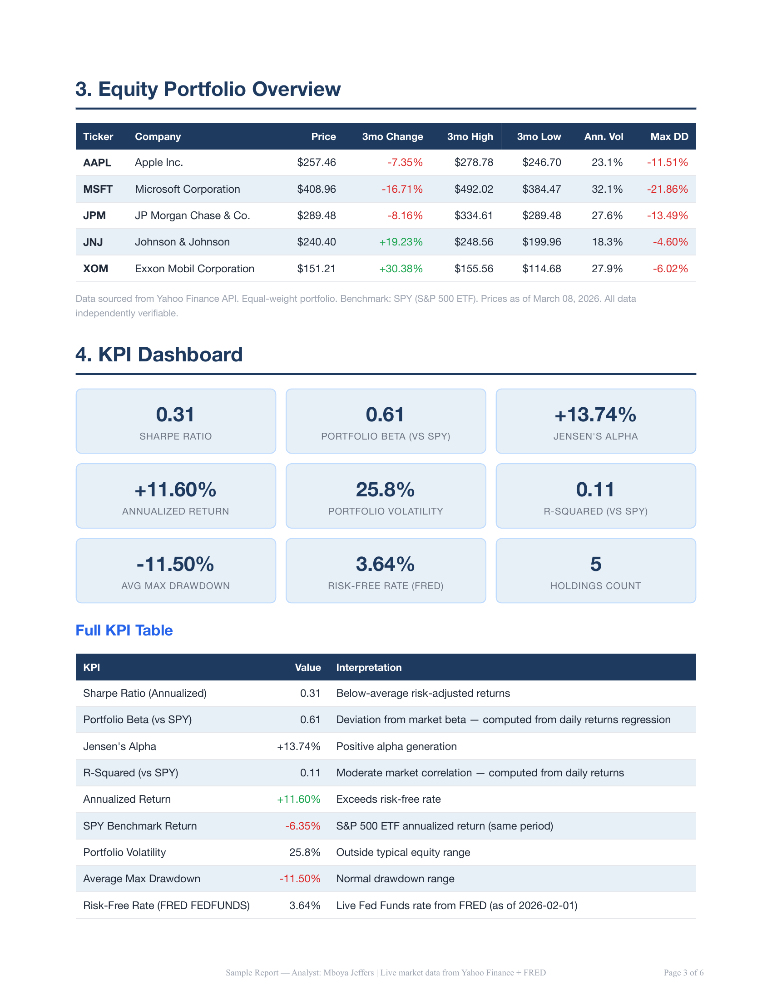
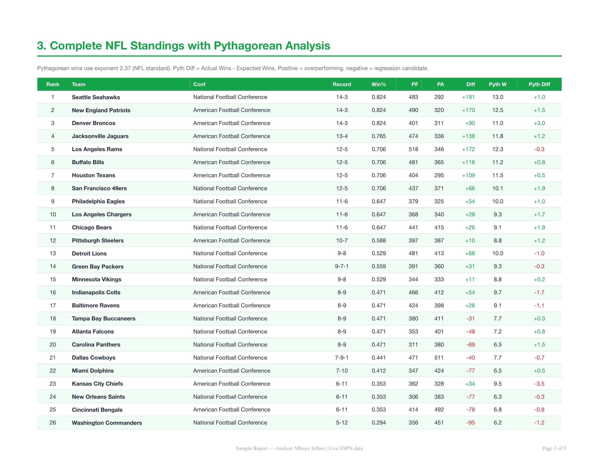

# Mboya Jeffers — Market Intelligence Reports


89 branded intelligence reports across 9 industry verticals — built from live public API data, rendered as institutional-quality PDFs, with every number traceable to its source.

Three of these reports were built as live-data demos tailored to real prospective clients before they committed to anything. That's the capability this repo is designed to show.

---

## White-glove demos — the sharpest thing here

Three prospect-specific reports. 100% live data pulled at generation time. No synthetic figures. Every metric cites its API endpoint and pull timestamp.

| Demo | Prospect Profile | Vertical | Data Sources |
|------|-----------------|----------|--------------|
| [**Aptus Capital Advisors**](white-glove/Aptus_Capital_WhiteGlove_Demo.pdf) | $9.9B AUM, 30-person investment firm | Finance | Yahoo Finance (5 equities + SPY benchmark) + FRED (5 macro series) |
| [**Multicoin Capital**](white-glove/Multicoin_Capital_WhiteGlove_Demo.pdf) | $1B+ AUM crypto fund, 17 people | Crypto | CoinGecko live — top 20 assets by market cap |
| [**PO&G Resources, LP**](white-glove/POG_Resources_WhiteGlove_Demo.pdf) | 500+ well energy operator, posted Data Analyst job | Oil & Gas | EIA API v2 (crude MBBL/D + natural gas marketed MMCF) + Yahoo Finance (CL=F, NG=F) |

Each demo includes a proposal page with engagement terms and a direct cost comparison to a full-time hire.

---

## Report catalog — 89 PDFs

### Enterprise showcase — production-quality client reports

Branded reports for fictional enterprise clients demonstrating what a delivered product looks like:

| Client | Vertical | Reports |
|--------|----------|---------|
| **Apex Capital Advisors** | Finance | [Quarterly](showcase/finance/Apex_Capital_Q3_2025_Comprehensive_Analysis.pdf) · [Monthly](showcase/finance/Apex_Capital_Monthly_Portfolio_Review_2025-11.pdf) · [Weekly](showcase/finance/Apex_Capital_Weekly_Market_Pulse_2025-11-21.pdf) |
| **Meridian Digital Assets** | Crypto | [Quarterly](showcase/crypto/Meridian_Crypto_Q3_2025_Portfolio_Analysis.pdf) · [Monthly](showcase/crypto/Meridian_Crypto_Monthly_Review_2025-11.pdf) · [Weekly](showcase/crypto/Meridian_Crypto_Weekly_Snapshot_2025-11-21.pdf) |
| **Sentinel Energy Partners** | Energy | [Monthly](showcase/energy/Sentinel_Energy_Monthly_Production_2025-11.pdf) |
| **Baseline Sports Analytics** | Sports | [Weekly](showcase/sports/Baseline_Sports_Weekly_Intelligence_2025-11-21.pdf) |
| **Platform Overview** | All | [Showcase Index](showcase/Enterprise_Showcase_Index.pdf) · [Capabilities](showcase/Data_Platform_Capabilities.pdf) |

### Recurring intelligence (23 reports)

| Cadence | Count | Verticals covered |
|---------|-------|------------------|
| Weekly | 9 | Finance, Brokerage, Crypto, Gaming, Sports, Weather, Solar, Compliance, Executive |
| Monthly | 9 | Same verticals — month-over-month trend layer |
| Quarterly | 5 | Financial Markets, Digital Economy, Energy & Climate, Sports & Compliance, Executive |

Browse: [`reports/weekly/`](reports/weekly/) · [`reports/monthly/`](reports/monthly/) · [`reports/quarterly/`](reports/quarterly/)

### Industry deep-dives (39 reports)

| Vertical | Reports | Examples |
|----------|---------|---------|
| Media & Streaming | 8 | Platform KPIs, content trends, audience analytics |
| Crypto | 7 | Portfolio risk, DeFi metrics, market structure |
| Sports & Betting | 6 | Odds modeling, spread accuracy, league analysis |
| Finance | 5 | Macro, equity performance, sector rotation |
| Solar | 5 | Resource screening, generation estimates, ROI |
| Compliance | 4 | XBRL analysis, regulatory filing patterns |
| Gaming | 2 | Player engagement, retention, pricing |
| Sports | 1 | Premier League snapshot |
| Weather | 1 | 5-year multi-city analysis |

Browse: [`reports/industry/`](reports/industry/)

### Methodology & summaries (12 reports)

Six executive summaries (Federal Awards, SEC XBRL, Aviation, Healthcare, Cybersecurity, Energy Grid) and six methodology deep-dives covering KPI derivation, data validation, and pipeline architecture.

Browse: [`reports/summaries/`](reports/summaries/) · [`reports/methodology/`](reports/methodology/)

---

## Sample pages

<table>
<tr>
<td align="center"><strong>Finance</strong></td>
<td align="center"><strong>Crypto</strong></td>
<td align="center"><strong>Energy</strong></td>
<td align="center"><strong>Sports</strong></td>
</tr>
<tr>
<td></td>
<td></td>
<td></td>
<td></td>
</tr>
<tr>
<td></td>
<td></td>
<td></td>
<td></td>
</tr>
<tr>
<td></td>
<td></td>
<td></td>
<td></td>
</tr>
</table>

---

## Services

Ongoing analytics reports across four verticals. Every report uses live data pulled at generation time.

### Financial analytics

Macro indicators (FRED), equity performance (Yahoo Finance), sector rotation, risk decomposition (Sharpe, beta, alpha, max drawdown).

| | Starter | Pro | Enterprise |
|--|---------|-----|------------|
| **Weekly** | $200 | $400 | $1,000 |
| **Monthly** | $400 | $1,200 | $3,000 |
| **Quarterly** | $1,000 | $3,000 | $7,000 |

### Crypto portfolio analytics

Portfolio KPIs (VaR, Sharpe, Sortino, HHI concentration), top-20 market structure, volume anomaly detection.

| | Starter | Pro | Enterprise |
|--|---------|-----|------------|
| **Weekly** | $250 | $500 | $1,200 |
| **Monthly** | $500 | $1,500 | $3,500 |
| **Quarterly** | $1,200 | $3,500 | $8,000 |

### Energy market intelligence

Production trends (EIA API), commodity pricing, revenue estimates, supply structure.

| | Starter | Pro | Enterprise |
|--|---------|-----|------------|
| **Weekly** | $200 | $400 | $1,000 |
| **Monthly** | $400 | $1,200 | $3,000 |
| **Quarterly** | $1,000 | $3,000 | $7,000 |

### Sports analytics

League standings, Pythagorean win projections, conference breakdowns, performance trends.

| | Starter | Pro | Enterprise |
|--|---------|-----|------------|
| **Weekly** | $150 | $300 | $800 |
| **Monthly** | $300 | $900 | $2,500 |
| **Quarterly** | $800 | $2,500 | $6,000 |

**Tier breakdown:**
- **Starter** — Core KPIs, single-portfolio or single-entity focus
- **Pro** — Full KPI suite, benchmark comparisons, data export, trend overlays
- **Enterprise** — Multi-portfolio, custom branding, compliance-ready formatting, audit trail, sign-off workflow

**White-glove retainer** (embedded analytics partner) — $5,000–$20,000/month. Dedicated pipeline, custom vertical scope, weekly + monthly + quarterly cadence, direct delivery.

[Full service overview →](showcase/Service_Offerings_2026.pdf)

### How to engage

Email **MboyaJeffers9@gmail.com**:
- Which vertical (finance, crypto, energy, sports)
- Which cadence (weekly, monthly, quarterly)
- Which tier — or request a white-glove demo first

White-glove demo: if you want to see a report built around your firm's actual profile before committing, that's available on request.

---

## Report generators — how the reports are built

Four standalone Python scripts. Each pulls live data from public APIs and renders a branded PDF.

| Generator | Data sources | What it computes |
|-----------|-------------|-----------------|
| [`generate_finance_report.py`](generators/generate_finance_report.py) | Yahoo Finance + FRED | Returns, volatility, Sharpe, beta, alpha, max drawdown, macro overlay (CPI, rates, unemployment) |
| [`generate_crypto_report.py`](generators/generate_crypto_report.py) | CoinGecko | VaR, Sortino, HHI concentration, 24h + 30d performance, market cap distribution |
| [`generate_energy_report.py`](generators/generate_energy_report.py) | EIA API v2 + Yahoo Finance | Crude/NG production (MBBL/D, MMCF), WTI + Henry Hub pricing, supply trends |
| [`generate_sports_report.py`](generators/generate_sports_report.py) | ESPN | Standings, Pythagorean projections, win%, point differential, conference breakdowns |

Shared [`report_template.py`](generators/report_template.py) provides consistent KPI grids, risk badges, source attribution tables, and industry-specific color schemes.

**Run any generator:**

```bash
pip install weasyprint yfinance requests
python generators/generate_finance_report.py
```

No paid API keys required. All sources are public endpoints.

---

## Data sources

| Source | What it provides | Scale |
|--------|-----------------|-------|
| **FRED** (St. Louis Fed) | 50 macro series — GDP, CPI, yield curve, unemployment, rates | 368K observations |
| **Yahoo Finance** | OHLCV for 200 equities, 5-year daily history | 529K price records |
| **CoinGecko** | Market data for top cryptocurrencies | 21K market records |
| **EIA API v2** | US crude and natural gas production, pricing | Production time series |
| **Open-Meteo** | Hourly weather — 30 US cities, 10-year history | 2.6M hourly readings |
| **SEC EDGAR** | Corporate filings and XBRL financial facts | 570K filing records |
| **ESPN** | Standings and results — 4 major leagues | 21K standings records |
| **Steam / SteamSpy** | Player counts, game ownership data | 37K game records |

**Total: 4.3M+ data points across 30+ star schema dimension and fact tables.**

### Data quality standard

Every pipeline output passes validation before a report is generated:

- **Completeness** — null rates below 5% on all measure columns
- **Uniqueness** — no duplicate natural keys in dimension tables
- **Range** — values within expected bounds per metric type
- **Consistency** — same metric produces the same value across all report sections
- **Attribution** — every number cites its API endpoint, series ID, and pull date

---

## For sales partners and BD

If you place analytics reports or data services with institutional buyers — hedge funds, asset managers, energy operators, crypto funds, family offices, compliance teams — and you're looking for something to add to what you sell, let's talk.

**What the engagement looks like:** Rev-share or referral fee on closed deals. You handle the relationship; the reports are already built and the pipeline is live. White-glove demos are available for qualified prospects before any commitment. No volume requirement to start.

**Contact:** MboyaJeffers9@gmail.com

---

## Repo structure

```
financial-market-analysis/
├── generators/                  # Python report generators + shared template
├── reports/
│   ├── weekly/                  # 9 weekly intelligence reports
│   ├── monthly/                 # 9 monthly review reports
│   ├── quarterly/               # 5 quarterly strategic reports
│   ├── industry/                # 39 vertical analysis reports
│   ├── summaries/               # 6 executive summaries
│   └── methodology/             # 6 methodology deep-dives
├── samples/                     # Sample PDFs (one per vertical)
├── showcase/                    # Enterprise showcase + service overview
│   ├── finance/                 # Apex Capital reports
│   ├── crypto/                  # Meridian Digital Assets reports
│   ├── energy/                  # Sentinel Energy reports
│   └── sports/                  # Baseline Sports reports
├── white-glove/                 # 3 live-data prospect-specific demos
├── images/                      # Report page preview images
├── methodology/                 # KPI definitions
└── data-sources/                # API reference
```

---

## Author

**Mboya Jeffers** — Data & ML Engineer

[GitHub](https://github.com/mboyajeffers) · [LinkedIn](https://linkedin.com/in/mboya-jeffers-6377ba325) · MboyaJeffers9@gmail.com · Remote (US-based)

*Analytics consulting and embedded data partnerships.*
